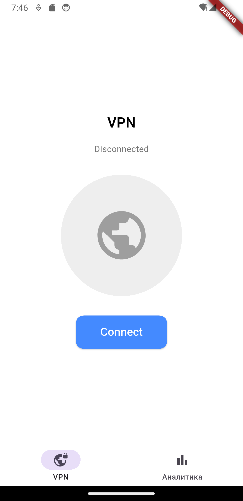
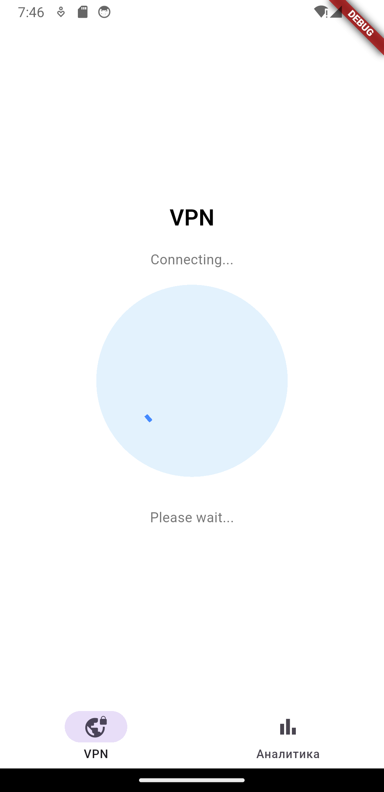
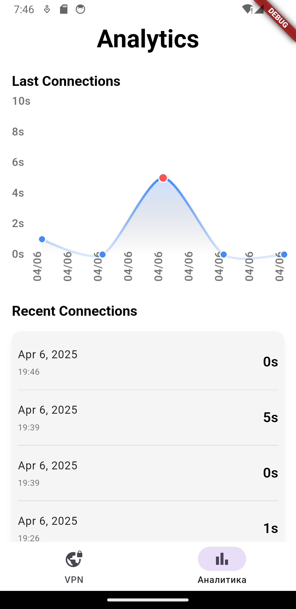

# 🚀 VPN Flutter App

Тестовое задание для Flutter-разработчика: минималистичное VPN-приложение с аналитикой, локальным хранением и Firebase Analytics.

## 📱 Описание

Приложение состоит из двух экранов:

- **Экран подключения**
  - Кнопка "Подключиться" / "Отключиться".
  - Индикация текущего состояния VPN.
  - Секундомер с момента подключения.
  - Анимация при подключении.

- **Экран аналитики**
  - График последних 5 подключений (время и длительность).
  - Список подключений.
  - Интеграция с Firebase Analytics (события `vpn_connected`, `vpn_disconnected`).

---

## 🛠️ Стек технологий

- `Flutter`
- `BLoC` (состояния и логика)
- `Hive` (локальное хранение сессий)
- `Firebase Analytics` (отслеживание событий)
- `Sizer` (адаптивная верстка)
- `fl_chart` (графики)
- `mockito`, `flutter_test` (юнит-тесты)

---

## ✨ Особенности

- 🧱 Чистая архитектура (разделение слоев: data/domain/presentation)
- 📊 Визуализация аналитики
- 💾 Локальное хранение сессий
- 🧪 Покрытие unit-тестами ключевых методов
- 🖼️ Адаптивный UI для любых размеров экрана
- 🎨 Единая тема и современный дизайн

---

## 📸 Скриншоты

### 🌐 Экран подключения

<table>
  <tr>
    <td align="center"> 🟡 Ожидание подключения</td>
    <td align="center"> 🔵 Подключение...</td>
    <td align="center"> 🟢 Подключено</td>
  </tr>
</table>

### 📊 Аналитика

  

  График и список последних VPN-сессий с отображением длительности

